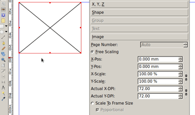

- Open the "window > properties" palette
- Scale the content to the frame

If by default Scribus uses "Free Scaling", it can happen that it looks as if, Scribus failed to load the image:

You can change the Preferences (for future documents) and the Document settings (for the current document) to get the new images to be automatically scaled by default. It's in the "Tools > Image frame" section. 
