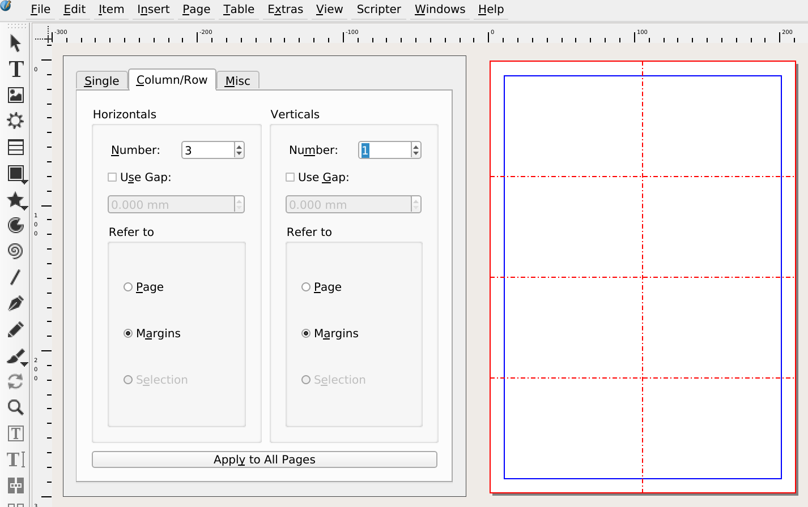

Scribus verfügt nicht über eine eingebaute Methode um Etiketten zu erstellen. Und Scribus ist auch wahrscheinlich nicht das beste Werkzeug dafür.

Es gibt jedoch Fälle, in denen du es einfach tun willst - Scribus könnte sogar das geeignete Werkzeug dafür sein - und in der Tat kannst du mit Scribus Etiketten erstellen.

## Grid und Mehrfach Duplizieren

Wenn alle Etiketten gleich sind (z.B. für Visitenkarten), kannst du einfach einen Element anlegen und es mehrfach duplizieren.

Achte darauf, dass du die Seitenränder richtig eingestellt hast, damit die erzeugte Pdf auf deinen Etiketten korrekt gedruckt wird.

Mit " Seite > Hilfslinien verwalten " ein Raster erstellen; In der " Spalte / Zeile " die horizontalen Werte so einstellen, dass sie der Anzahl der Etiketten entsprechen (minus eins, da wir die Trennlinien setzen). Bitte wähle "Siehe Margins".

Nun kannst du die Etikette in der linken oberen _Zelle_ erstellen.

Wenn du bereit bist, das endgültige Pdf zu erstellen, brauchst du noch einen transparenten Rahmen um deine Vorlage:

- Das Formwerkzeug aktivieren (bei rechteckiger Form).
- klicke mit der Shift-Taste innerhalb des Bereichs der ersten Zelle, um ein Rechteck von der Größe der Zelle zu erstellen.
- Die Kontur des Rechtecks transparent setzen (wählen dafür die Farbe _Keine_ aus).

Du bist schließlich bereit, die Etikette zu duplizieren:

- Wähle den Inhalt der ersten Zelle aus.
- Gehe zu "Element > Duplizieren / Transformieren > Mehrfach duplizieren", wählen Sie die Registerkarte "Nach Zeilen & Spalten", stelle die richtige Anzahl von Zeilen und Spalten ein und dupliziere.
- Das Pdf erstellen.
- Wahrscheinlich wirst du die Datei mit den duplizierten Elementen nicht speichern wollen, sondern nur nach Pdf exportieren, also vor dem Duplizieren speichern!

## Imposition

- `pdfmerge` und `pdfnup` aus dem `pdffjam` Package.

## The Scribus Generator

Der [Scribus Generator](https://github.com/berteh/ScribusGenerator) ist ein Python-Skript, mit dem Sie Mail-Merging mit Scribus durchführen können.

Weitere Details folgen.
