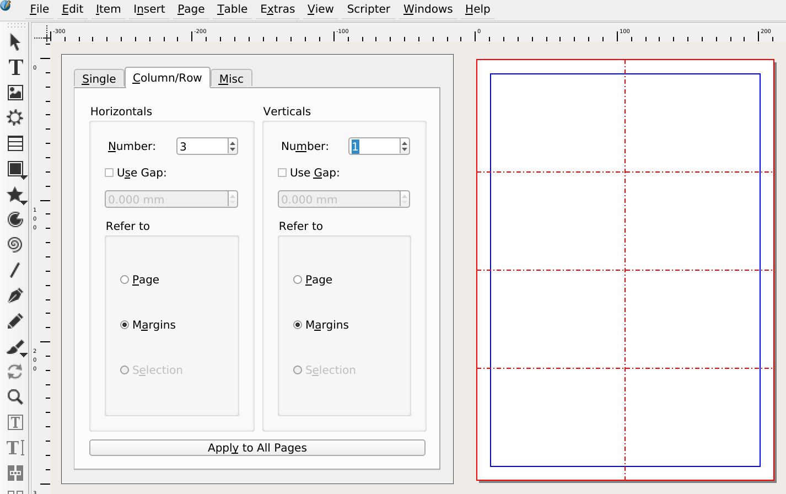

Scribus does not have a built in way to create labels. And it's probably not the best tool for creating them.

But there are cases when you simply want to do it - or when Scribus is even the appropriate tool - and, indeed, you can do labels with Scribus.

## Grid and multiple duplicate

If all the labels are the same (as an example for business cards), you can simply create one item and duplicate it multiple times.

Make sure that you have correctly set the page margins so that the resulting Pdf will print on your labels.

Create a grid with "Page > Manage Guides"; In the "Column / Row" set the horizontal numbers to match the number of labels (minus one, since we're  setting the separations). Please use "Refer to Margins".

Now, you can create your label in the top left _cell_.

When you're ready for creating the final Pdf, you need to first put a transparent frame around your artwork:

- Activate the shape tool (with a rectangular shape).
- Shift-click inside of the area of the first cell to create a rectangle of the size of the cell.
- Make the stroke of the rectangle transparent (pick the _None_ color).

Your finally ready to duplicate the label:

- Select the content of the first cell (by clicking a bit more to the left and towards the top of the actual area and dragging down to the right corner and a bit further).
- Go to "Item > Duplicate / Transform > Multiple dupclicate", pick the "By Rows & columns" tab, set the correct number of rows and columns and duplicate.
- Create the Pdf.
- You will probably not want to save the file with the duplicated items, only export it to Pdf, so save before duplicating!

## Imposition

Again, if all labels are the same, you can create the labels at their final size, produce a pdf with a single label, and use an imposition tool to create the final document.

- `pdfmerge` and `pdfnup` from the `pdffjam` package.

## The Scribus Generator

The [Scribus Generator](https://github.com/berteh/ScribusGenerator) is a Python script that lets you do mail merging with Scribus.

More details will follow.

