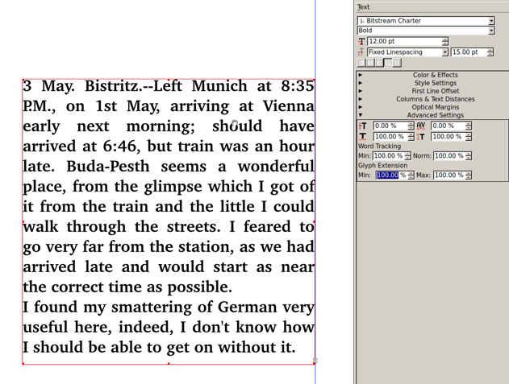

When text is justified, you often want to improve the text to flow to avoid big white spaces. There are several steps:

- Hyphenate the text
- Adjust the word tracking
- Play with the letter spacing and the scale of the characters

