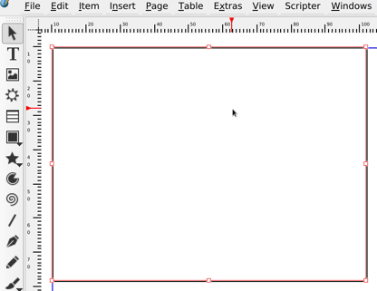

You can easily create an hanging indent in the main Scribus UI, but you have little control on the distances:

Or you can create a "list" style and define its indent in a more controlled way:

Don't forget to add a tab, since scribus does  "snap" to the indents.
